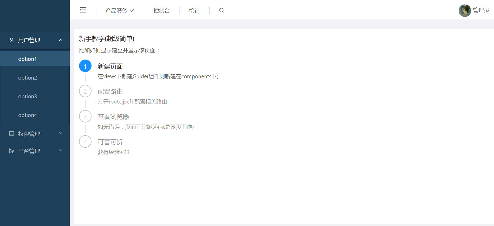

从零开始搭建的基于**webpack + react + react-dom-router + antd + es6/7 + less**工程项目，
表示不想再搭建第二次了，简直吐血。
不管怎么说，这也算一套脚手架了，可以直接拿来用：



```git bash
# 拷贝
$ git clone https://github.com/littlezong/gnoz-antd-cli.git 文件夹

# 进入项目
$ cd 文件夹

# 安装依赖
$ yarn install

# 运行
$ yarn start

# 打包（打包后的文件在dist中）
$ yarn build
```


